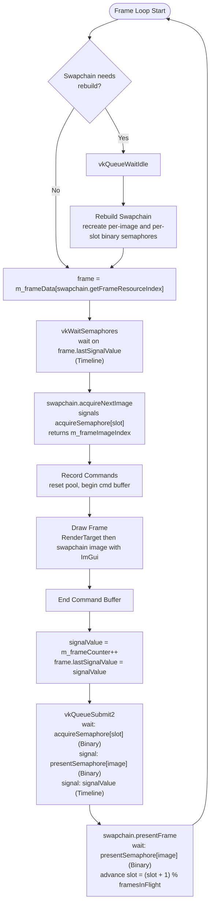
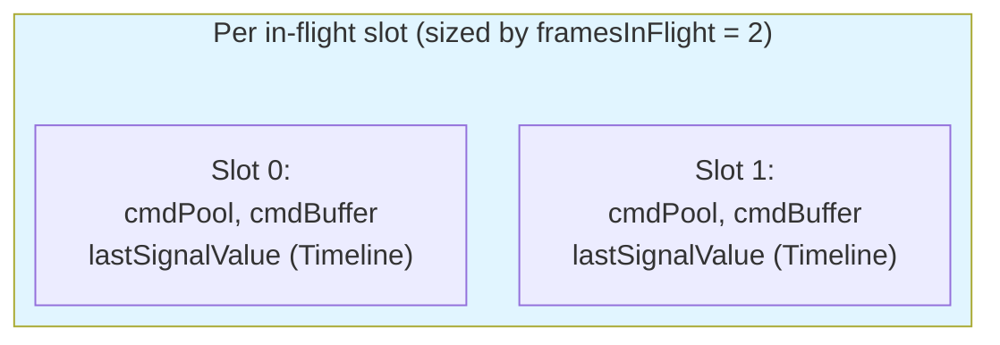
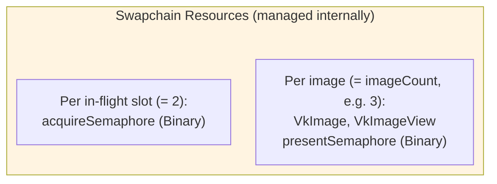
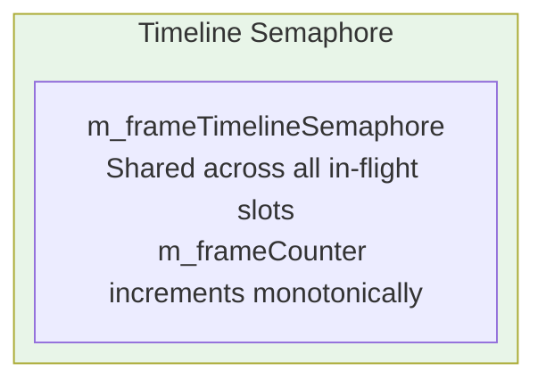
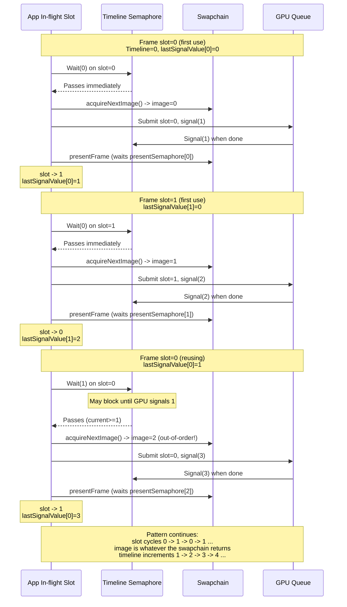

# Modern Vulkan Application Sample


This repository demonstrates contemporary Vulkan API usage patterns in two files: a reusable Vulkan framework header ([`src/vk_framework.h`](src/vk_framework.h)) and the sample itself ([`src/minimal_latest.cpp`](src/minimal_latest.cpp)). The example showcases Vulkan 1.4 core functionality, implemented with current best practices. Therefore, Vulkan 1.4 is mandatory.


> **Note**: This is not intended as a tutorial, but rather as a reference implementation demonstrating modern Vulkan development techniques.

## Requirements

This sample intentionally targets **bleeding-edge Vulkan**. Its whole reason to exist is to demonstrate what a modern Vulkan application looks like when it uses the newest features the ecosystem provides. That means you need a very recent driver and SDK to run it, and some readers will only be able to *read* the code rather than run it -- that is an accepted trade-off.

**Vulkan 1.4 core is mandatory**, both loader and device. The sample asserts this at startup.

**Required device extensions** (the build will fail to run on devices that lack any of these):

| Extension | Purpose |
| --- | --- |
| `VK_KHR_swapchain` | Window-system presentation. |
| `VK_KHR_unified_image_layouts` | Lets the sample use `VK_IMAGE_LAYOUT_GENERAL` for all attachments (color + depth + swapchain), removing every layout-transition barrier except present. |
| `VK_EXT_descriptor_heap` | Bindless sampler + resource heaps in place of descriptor sets / pools / layouts. |
| `VK_KHR_shader_untyped_pointers` | Required by `VK_EXT_descriptor_heap`. |
| `VK_EXT_shader_object` | No graphics `VkPipeline`; the graphics path is `VkShaderEXT` plus dynamic state. |
| `VK_EXT_extended_dynamic_state3` | Blend / rasterization dynamic state for shader objects. |
| `VK_EXT_vertex_input_dynamic_state` | Dynamic vertex input for shader objects. |

**Driver availability.** At the time of writing `VK_EXT_descriptor_heap` is brand new: expect to need an NVIDIA R555-series driver or newer (possibly a Vulkan beta driver) to run this sample. AMD and Intel support for the full extension set is still emerging -- check `vulkaninfo` against the table above before filing build / run issues. If an extension is missing, the app will abort at startup with a clear "Required device extension not available" message.

**What this sample deliberately does *not* teach.** These topics are intentionally absent; if you need to learn them, look for a more traditional Vulkan tutorial.

- Classic render passes and framebuffers (replaced by dynamic rendering).
- Graphics `VkPipeline` / `VkPipelineLayout` (replaced by shader objects + per-frame `vkCmdSet*EXT` calls).
- Descriptor sets, layouts, and pools for non-ImGui code (replaced by the descriptor heap; ImGui still uses a small legacy pool because its backend predates the heap).
- Explicit layout transitions for color / depth attachments (unnecessary under `VK_KHR_unified_image_layouts`).

For the swapchain sync model, the narrative walkthrough in [`doc/swapchain_restaurant.md`](doc/swapchain_restaurant.md) is more approachable than a direct code read.

**Maintenance cadence.** Dependencies (GLM, VMA, Volk) track `master` so the sample stays current with the latest Vulkan headers -- see `CMakeLists.txt`. Expect periodic upstream sync to keep the build green. If you fork this for production, pin those `GIT_TAG`s to a release you have validated.

## Features Demonstrated

This sample application implements numerous Vulkan concepts and patterns:

### Core Vulkan Setup
* Vulkan Instance creation and management
* Validation layers with configurable settings
* Debug callback implementation
* Physical device selection and logical device creation
* Queue management (graphics queue focus)
* Extension and feature handling with graceful fallbacks

### Modern Rendering Techniques
* Dynamic rendering (no render passes, no framebuffers)
* Shader objects (`VK_EXT_shader_object`) for the graphics path -- no graphics `VkPipeline` at all; everything is a `VkShaderEXT` plus dynamic state
* Swapchain management with proper separation of swapchain images (presentation parallelism, default 3) and frames-in-flight (CPU parallelism, default 2)
* Frame synchronization with timeline semaphores and a single monotonic counter
* Per-image vs per-slot semaphore ownership (presentSemaphore per image, acquireSemaphore per in-flight slot)
* Offscreen `RenderTarget` (color + depth) drawn into and shown via `ImGui::Image`
* Buffer references (`buffer_reference`) in shaders, backed by buffer device address
* Specialization constants used to spawn shader-object variants

### Memory and Resource Management
* Vulkan Memory Allocator (VMA) integration
* Descriptor heap (`VK_EXT_descriptor_heap`) for textures and samplers, replacing traditional descriptor sets/layouts/pools (ImGui still uses a small legacy descriptor pool)
* Buffer device address (BDA), opt-in per buffer, for storage and uniform buffers (vertex, points, scene info)
* Push data (`vkCmdPushDataEXT`) for graphics (no pipeline layout) and push constants (`vkCmdPushConstants2`) for compute (traditional layout)
* SSBO (Shader Storage Buffer Objects) and UBO (Uniform Buffer Objects)
* Image and sampler handling
* Buffer and image barrier management (`vkCmdPipelineBarrier2`)

### Shader and Pipeline Implementation
* **Graphics: shader objects** (`VK_EXT_shader_object`).
  * One shared vertex `VkShaderEXT` plus two fragment `VkShaderEXT` variants (specialization constant for `useTexture` true/false)
  * `VK_SHADER_CREATE_DESCRIPTOR_HEAP_BIT_EXT` set on every shader; no descriptor set layouts, no push constant ranges
  * Bound at draw time with `vkCmdBindShadersEXT`; unused stages (tess control / tess eval / geometry) explicitly bound to `VK_NULL_HANDLE` as required by spec
  * Every piece of state that used to live in a pipeline is set per-frame: `vkCmdSetVertexInputEXT`, `vkCmdSetCullMode`, `vkCmdSetPolygonModeEXT`, `vkCmdSetRasterizationSamplesEXT`, `vkCmdSetColorBlendEnableEXT` / `Equation` / `WriteMask`, `vkCmdSetDepthTestEnable`/`WriteEnable`/`CompareOp`, etc.
* **Compute: traditional pipeline** (`VkPipeline` + `VkPipelineLayout` with a `VkPushConstantRange`). `VK_EXT_shader_object` supports compute too, but compute is intentionally kept on the traditional path here so the sample shows both styles side-by-side. Compute also doesn't benefit from shader objects' main wins (no dynamic state to make dynamic, single-shader pipeline so nothing to mix and match) -- see the comment block on `createComputeShaderPipeline` for the full rationale and a sketch of the shader-object equivalent.
* Modern bind APIs throughout: `vkCmdBindShadersEXT`, `vkCmdBindVertexBuffers2`, `vkCmdBindSamplerHeapEXT`, `vkCmdBindResourceHeapEXT`
* Buffer updates via `vkCmdUpdateBuffer` against a BDA-addressed scene buffer

### Third-Party Integration
* Volk for Vulkan function pointer loading
* Dear ImGui for user interface
* GLFW for window management and input handling
* GLM for mathematics operations

### Shader Compilation
* GLSL to SPIR-V compilation
* [Slang](https://github.com/shader-slang/slang) for shader compilation

## Application Overview

When running the application, you'll see:
* A rotating, colored triangle (vertices updated via compute shader)
* A textured triangle
* Screen positioned colored dots
* Triangle intersection demonstration
* Interactive UI elements

## Technical Implementation

### Initialization Flow
1. GLFW initialization provides the window and required Vulkan extensions
1. Vulkan context creation (Instance, Physical/Logical Devices, Queues)
1. Surface creation through GLFW
1. Swapchain initialization (chooses image count and frames-in-flight independently)
1. VMA allocator setup
1. Resource creation:
   - Command buffers for setup operations
   - Per-slot frame data (`m_frameData`, sized by frames-in-flight, **not** image count)
   - Descriptor heap (sampler + resource heap GPU buffers)
   - Offscreen `RenderTarget` (color + depth)
   - **Graphics shader objects** (one `VkShaderEXT` per stage variant) and compute `VkPipeline` (traditional layout)
   - Buffer allocation (SSBO for geometry/points, UBO for per-frame scene info; all accessed via BDA)
   - Texture upload and writing of image descriptors into the resource heap

### Frame Rendering Pipeline
1. Wait on the timeline semaphore for this slot's previous submission to complete
1. Acquire the next swapchain image (returns an image index that may differ from the slot index)
1. Reset the slot's command pool and begin the command buffer
1. Compute shader updates the animated triangle's vertices in place (`vkCmdPushConstants2` + BDA)
1. Update the scene info buffer with per-frame data (`vkCmdUpdateBuffer`)
1. Dynamic rendering into the offscreen `RenderTarget`:
   - Set every required dynamic state (`vkCmdSetViewportWithCount`, `vkCmdSetVertexInputEXT`, `vkCmdSetCullMode`, blend / depth / multisample setters, ...)
   - Bind sampler + resource descriptor heaps (`vkCmdBind*HeapEXT`)
   - Bind shader objects (`vkCmdBindShadersEXT`); swap fragment shader between the two draws
   - Two `vkCmdDraw` calls with their per-draw `vkCmdPushDataEXT`
1. Dynamic rendering into the swapchain image, with ImGui drawing the `RenderTarget` quad and overlay UI
1. Submit with `vkQueueSubmit2`: wait on acquireSemaphore, signal presentSemaphore + timeline value
1. Present (waits on presentSemaphore)
1. Advance the in-flight slot index (modulo frames-in-flight, **not** modulo image count)

## Prerequisites
- Understanding of C++ programming
- Basic familiarity with graphics programming concepts
- Basic knowledge of Vulkan fundamentals

## Building and Running

```bash
# Clone the repository
git clone https://github.com/nvpro-samples/vk_minimal_latest
cd vk_minimal_latest

# Configure and build
cmake -S . -B build
cmake --build build --config Release
```

Running (Windows):

```bat
build\Release\vk_minimal_latest.exe
```

Running (Linux / macOS):

```bash
./build/vk_minimal_latest
```

## Dependencies

Besides the [Vulkan SDK](https://vulkan.lunarg.com/sdk/home), all the following dependencies are fetched automatically when configuring CMake.

- GLFW
- GLM
- Dear ImGui
- Volk
- VMA (Vulkan Memory Allocator)

Note:
- The Vulkan SDK should be installed and the `VULKAN_SDK` environment variable set.
- **Slang is the canonical shader language for this sample.** A GLSL port of every shader is also built so you can compare the two side by side. The default (`USE_SLANG=1`) lives at the top of [`src/minimal_latest.cpp`](src/minimal_latest.cpp); you can override it without editing source by configuring with `-DUSE_SLANG=OFF`.

## License
Apache-2.0

## Miscellanea

> The swapchain synchronization model is also explained as a restaurant (one cook, three plates, two waiters) in [`doc/swapchain_restaurant.md`](doc/swapchain_restaurant.md), with a translation table at the end mapping every prop back to its Vulkan object.

### Swapchain images vs frames in flight

Two counts that look similar but mean different things:

| Count                | Default | Sized by                | Purpose                                                |
| -------------------- | ------- | ----------------------- | ------------------------------------------------------ |
| **Swapchain images** | 3       | `vkGetSwapchainImagesKHR` | Presentation parallelism (display can scan one out while GPU writes the next). |
| **Frames in flight** | 2       | application choice      | CPU parallelism (how far the CPU is allowed to race ahead of the GPU). |

Going higher than 2 frames in flight rarely helps — it just buys extra command buffers and one more frame of input lag. The conventional pairing is **3 swapchain images + 2 frames in flight**, which this sample uses.

### Per-image vs per-slot resources

`vkAcquireNextImageKHR` may return swapchain images out of order (especially with `MAILBOX` present mode), so resources are tied to whichever index they actually belong with:

| Lives with          | Resource                                | Why                                                                 |
| ------------------- | --------------------------------------- | ------------------------------------------------------------------- |
| **Swapchain image** | `presentSemaphore`                      | Present consumes it for a *specific image*; per-slot would race itself when images come back out of order. |
| **In-flight slot**  | `acquireSemaphore`, command pool, command buffer, last-signaled timeline value | These follow the CPU's submission cadence, not the displayed image. |

### Timeline Semaphore

With N frames in flight, you must ensure you're not overwriting resources still in use by the GPU from N frames ago.

This implementation uses a **monotonic counter** (`m_frameCounter`) that increments by 1 with each submit. Each in-flight slot stores the timeline value it last signaled (`lastSignalValue`) and waits on that value before reuse.

Example with **2 frames in flight**:

```text
Timeline semaphore initial value: 0
m_frameCounter starts at: 1

Frame 0 (slot 0):
- wait(0)      // Passes immediately (semaphore at 0)
- Submit work
- signal(1)    // m_frameCounter = 1, then increment to 2
- slot[0].lastSignalValue = 1

Frame 1 (slot 1):
- wait(0)      // Passes (semaphore now at 1)
- Submit work
- signal(2)    // m_frameCounter = 2, then increment to 3
- slot[1].lastSignalValue = 2

Frame 2 (reusing slot 0):
- wait(1)      // NOW blocks until Frame 0 completes (GPU signals 1)
- Submit work
- signal(3)
- slot[0].lastSignalValue = 3

Frame 3 (reusing slot 1):
- wait(2)      // Blocks until Frame 1 completes (GPU signals 2)
- Submit work
- signal(4)
- slot[1].lastSignalValue = 4
```

**Key advantages:**
- Strictly monotonic timeline values (1, 2, 3, 4...) — no duplicate signals possible
- Simple to understand and debug: each frame gets the next number
- Clean architecture: timeline for app-level frame pacing, binary semaphores encapsulated in swapchain


### Frame Synchronization Flow









**Architecture Notes:**

- **In-flight slot index** (`Swapchain::getFrameResourceIndex()`) cycles `[0, framesInFlight)` and selects per-slot resources (command buffer, last-signaled timeline value, acquireSemaphore).
- **Swapchain image index** (`m_frameImageIndex`) is chosen by the presentation engine via `vkAcquireNextImageKHR()` and selects per-image resources (image, view, presentSemaphore).
- These indices are **independent and may differ**: slot 0 might render to image 2.
- **Binary semaphores** (`acquireSemaphore`, `presentSemaphore`) are fully encapsulated in the `Swapchain` class.
- **Timeline semaphore** is managed at the application level with a simple monotonic counter (`m_frameCounter`).
- This separation gives clear ownership: swapchain handles WSI synchronization, application handles frame pacing.

### Tracing the synchronization at runtime

If you want to see the slot/image/timeline values for every frame, configure CMake with `-DVK_SEMAPHORE_DEBUG=ON` (which defines `NVVK_SEMAPHORE_DEBUG=1` in the build). With it enabled the application logs a one-line trace at each step of the frame:

```text
WaitFrame:        slot=0 waitValue=0
AcquireNextImage: frameRes=0 imageIndex=0
SubmitFrame:      slot=0 signalValue=1
PresentFrame:     slot=0 imageIndex=0
WaitFrame:        slot=1 waitValue=0
AcquireNextImage: frameRes=1 imageIndex=0
SubmitFrame:      slot=1 signalValue=2
...
```

This is the easiest way to confirm the design rules in practice — slot index cycles `[0, framesInFlight)`, image index is whatever the swapchain hands back, and the timeline `waitValue`/`signalValue` pair matches per-slot. It also surfaces presentation-mode quirks: with FIFO you'll see neat rotation; with MAILBOX (vSync off) you'll see the same image acquired several times in a row when the app outpaces the display.

Alternatively, add `#define NVVK_SEMAPHORE_DEBUG` at the top of `minimal_latest.cpp` before any include, or wire `target_compile_definitions(vk_minimal_latest PRIVATE NVVK_SEMAPHORE_DEBUG)` into your own build.


## Sequence Diagram

With **2 frames in flight** and 3 swapchain images: the slot index cycles `0 → 1 → 0 → 1 …` while the image index is chosen by the presentation engine and is *not* a function of the slot index.


